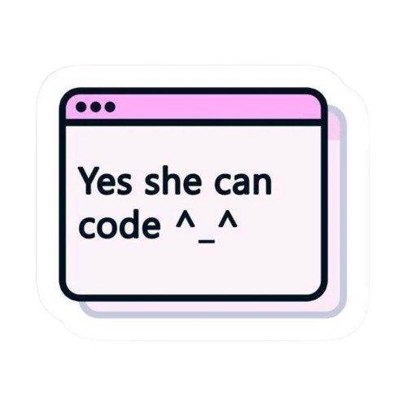
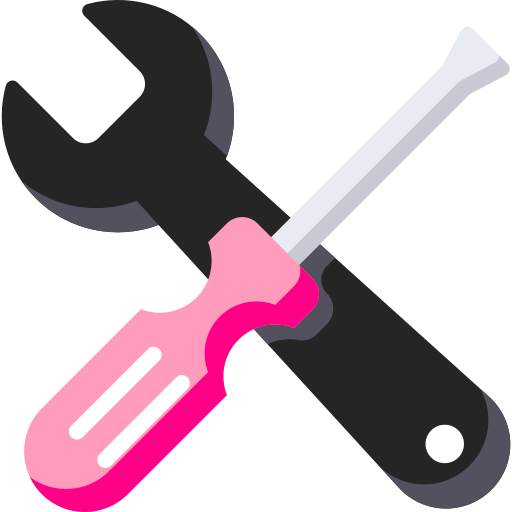

  

## Hi there 👋🏻

💫 ABOUT ME

👩🏼‍💻 I’m the girl who hides all the backend magic behind beautiful interfaces
I see code where others see websites :)

- 🔭 I’m currently working as a school tutor, teaching programming to students.  
- 🌱 I’m currently learning Rust and exploring its potential for system programming.  
- 💬 Ask me about web development, gamification, or creating interactive websites.  
- ⚡ Fun fact: I love building with construction sets and designing creative projects!

  
  Languages and Tools: 

                       

  &nbsp;
  &nbsp;
  &nbsp;
  &nbsp;
  &nbsp;
  

