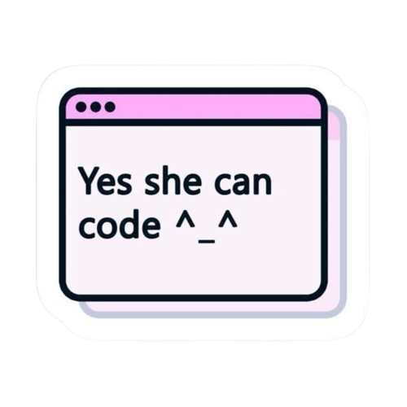
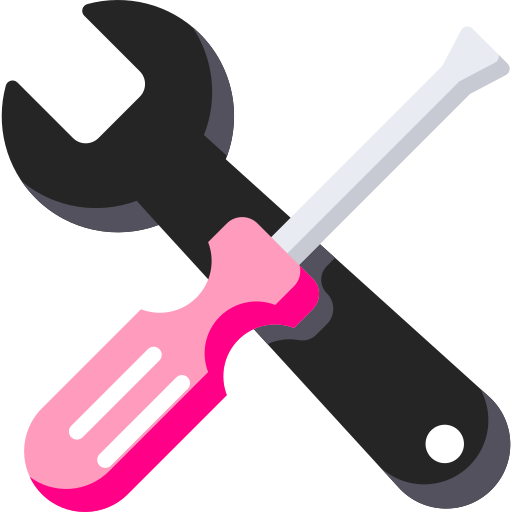

<!-- 

  

## Hi there 👋🏻

💫 ABOUT ME

👩🏼‍💻 I’m the girl who hides all the backend magic behind beautiful interfaces
I see code where others see websites :)

- 🔭 I’m currently working as a school tutor, teaching programming to students.  
- 🌱 I’m currently learning Rust and exploring its potential for system programming.  
- 💬 Ask me about web development, gamification, or creating interactive websites.  
- ⚡ Fun fact: I love building with construction sets and designing creative projects!

  
  Languages and Tools: 

                       

  &nbsp;
  &nbsp;
  &nbsp;
  &nbsp;
  &nbsp;
  
  

                       

How To Reach Me

  
  Telegram
  
  Discord
  
  Vk

 -->

<h1 align="center">Hi, I'm Annee 👋</h1>

  

---

### 💫 About me

- 🐍 Backend developer, mostly working with **Python**
- 🤖 Exploring **LLMs** — building AI-powered tools and integrations
- 👩🏻‍🏫 Teaching programming — from beginners to advanced, deep focus on Python
- 🎓 3 years at IT Top Academy — covered the full IT stack

---

### 🛠️ Tech Stack

  

  
  
  
  

---

### 📫 Reach me

  
  
  

  

